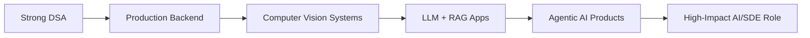

<div align="center">


<br/>

<a href="https://www.linkedin.com/in/saumsriv/">
  
</a>
<a href="mailto:saumyasriv21@gmail.com">
  
</a>
<a href="https://github.com/saumyasrivastava21">
  
</a>

<br/><br/>


</div>

---

##  About Me

```yaml
name: Saumya Srivastava
role: AI Engineer | Computer Vision Engineer | Backend Developer
education: B.Tech Information Technology, MMMUT Gorakhpur
cgpa: 8.60/10
current_focus:
  - Medical Imaging AI
  - Object Detection and YOLO Pipelines
  - LLM Applications, RAG and Agentic AI
  - Java Spring Boot and Production Backends
coding_profile:
  - 500+ DSA problems solved
  - Java-first problem solving
mission: Build scalable, reliable and production-ready AI systems.
```


- 🧠 AI Research Intern working on **medical imaging, computer vision and deep learning pipelines**  
- 🚀 Building **AI agents, RAG systems, scalable APIs and full-stack AI products**  
- 💻 Strong in **Java, Python, Spring Boot, FastAPI, PyTorch, TensorFlow and Docker**  
- 🎯 Interested in **AI Engineer, ML Engineer, Computer Vision Engineer and SDE roles**  
- 🏆 Winner at **ICMR & IIT Kanpur National Federation Hackathon**  

<br clear="right"/>

---

## 🚀 Current Work

<div align="center">

| Focus Area | What I Build | Tools |
|---|---|---|
| 🧠 Computer Vision | Detection, classification, ROI pipelines, medical imaging AI | YOLO, OpenCV, PyTorch, TensorFlow |
| 🤖 Generative AI | LLM apps, RAG pipelines, agent workflows | LangChain, LangGraph, FAISS, LLM APIs |
| ⚙️ Backend Engineering | APIs, auth, scalable services, deployment-ready systems | Java, Spring Boot, FastAPI, PostgreSQL, Docker |
| 📊 Model Evaluation | Error analysis, validation curves, mAP/F1/IoU tracking | Python, Pandas, Matplotlib, Ultralytics |

</div>

---

## 💼 Experience


### 🧠 AI Research Intern — OralVis Healthcare, IIT Hyderabad  
**Jan 2026 – Present**

- Worked on confidential **medical-imaging AI workflows** involving preprocessing, ROI extraction, object detection, deployment and scalable inference.
- Improved detection pipelines using **YOLO training, annotation refinement, augmentation, class balancing and hyperparameter tuning**.
- Evaluated models using **Precision, Recall, F1-score, IoU, mAP@50, mAP@50-95, validation curves and failure-case inspection**.

### 🏷️ ML Data Annotator — Mechanica Sistemi  
**Apr 2026 – May 2026**

- Annotated and refined **10,000+ images** using SAM, segmentation masks, bounding boxes and dataset-quality checks for production CV training.

<br clear="right"/>

---

## 🌟 Featured Projects

<table>
<tr>
<td width="50%">

### 🤖 AI Agent Full-Stack App Builder

Agentic AI platform that converts prompts into requirements, frontend pages, backend APIs, database schemas and deployable code.

**Tech:** LLM APIs, Spring Boot, React, PostgreSQL, Docker, REST APIs, CI/CD

</td>
<td width="50%">

### 🛣️ RoadGuard AI

YOLO-based road damage detection system with image upload, confidence scoring, annotated-result download and FastAPI inference.

**Tech:** YOLO, FastAPI, OpenCV, React, Vite, Tailwind  
**Result:** 96%+ detection accuracy on tests

</td>
</tr>
<tr>
<td width="50%">

### 🌱 KrishiMitram

Agriculture intelligence platform for crop disease classification and yield estimation using deep learning and supervised ML.

**Tech:** PyTorch, CNNs, Transfer Learning, Gradient Boosting, React  
**Result:** 96%+ accuracy

</td>
<td width="50%">

### 🧠 Medical Imaging AI Pipelines

Computer vision workflows for clinical image preprocessing, ROI extraction, object detection, model evaluation and inference.

**Tech:** YOLO, OpenCV, PyTorch, Grad-CAM, FastAPI

</td>
</tr>
</table>

---

## 🧰 Tech Arsenal

<div align="center">

### Languages & Core


### AI / ML / Data


### Backend / Cloud / DevOps


### Frontend


</div>

---

## 🧠 AI Engineering Stack

<div align="center">

| Category | Skills |
|---|---|
| **Computer Vision** | YOLO, OpenCV, Object Detection, ROI Extraction, Medical Imaging, Grad-CAM |
| **Deep Learning** | PyTorch, TensorFlow, CNNs, Transfer Learning, Model Evaluation |
| **Generative AI** | LLM APIs, Prompt Engineering, RAG, Agentic AI, Document Q&A |
| **RAG & Agents** | LangChain, LangGraph, FAISS, ChromaDB, Vector Search, Tool Calling |
| **Backend** | Java Spring Boot, FastAPI, REST APIs, Auth, PostgreSQL, Docker |
| **MLOps Basics** | Training Pipelines, Inference APIs, CI/CD, Cloud Deployment, Monitoring Mindset |

</div>

---

## 🏆 Achievements

<div align="center">

| Achievement | Highlight |
|---|---|
| 🥇 **Winner — ICMR & IIT Kanpur National Federation Hackathon** | Built an AI-driven diabetic retinopathy system selected among 300+ teams |
| 🧩 **500+ DSA Problems Solved** | Java-first problem solving across Graphs, DP, Trees, Arrays and Strings |
| 🎓 **CGPA 8.60/10** | B.Tech Information Technology, MMMUT Gorakhpur |
| 👥 **Student Secretary — CSSE MMMUT** | Led coding contests, AI/ML sessions, workshops and hackathons for 1,000+ participants |

</div>

---

## 📊 GitHub Analytics

<div align="center">


<br/>


<br/>


</div>

---

## 🏅 GitHub Trophies

<div align="center">


</div>

---

## 🐍 Contribution Snake

<div align="center">


</div>

---

## 📌 2026 Goals

<div align="center">



</div>

---

## 🤝 Let's Connect

<div align="center">

I love building at the intersection of **AI, software engineering and real-world products**.  
Open to collaborating on **Computer Vision, LLM Apps, RAG Systems, Agentic AI and Backend Engineering**.

<br/>

<a href="https://www.linkedin.com/in/saumsriv/">
  
</a>
<a href="mailto:saumyasriv21@gmail.com">
  
</a>
<a href="https://github.com/saumyasrivastava21">
  
</a>

</div>

---

<div align="center">


</div>
