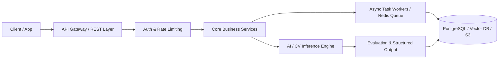
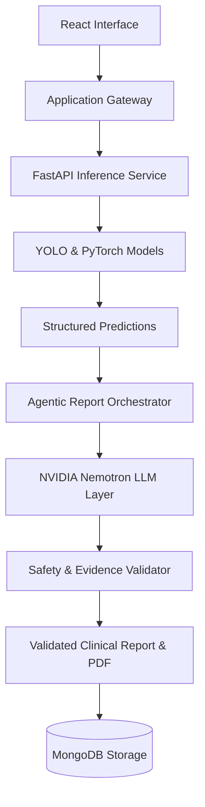
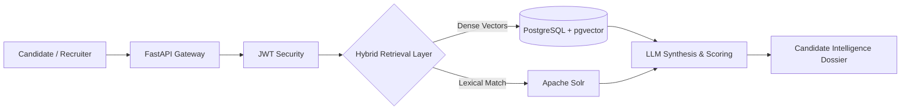
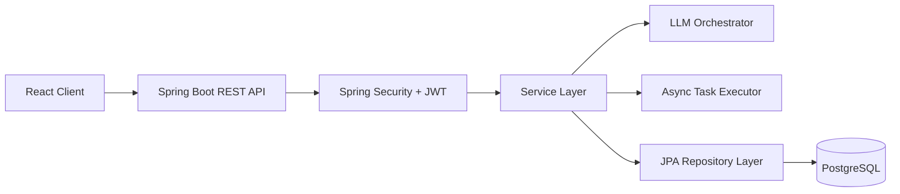

 

**AI Intern – AI Enabled Systems Hybrid @ OralVis Healthcare, IIT Hyderabad** · Lucknow, India

 

  

---

### Quick Profile

| Dimension | Details |
| :--- | :--- |
| 🎓 **Education** | B.Tech in Information Technology — MMMUT Gorakhpur (2023–2027) · **CGPA: 8.60/10** |
| 📍 **Location** | Lucknow, Uttar Pradesh, India |
| 💼 **Current Role** | AI Intern – AI Enabled Systems Hybrid @ OralVis Healthcare · IIT Hyderabad |
| 🧠 **Core Focus** | Medical Computer Vision · Generative AI / RAG · Agentic Systems · Scalable Backend Architecture |
| 🏆 **Top Honor** | **National Winner (1st / 300+ Teams)** — ICMR & IIT Kanpur National Federation Hackathon |
| 💻 **Problem Solving** | **500+ DSA problems** solved across LeetCode, Codeforces, and GeeksforGeeks (Java, Python) |
| 🌐 **Live Portfolio** | [portfolio-saumya-eight.vercel.app](https://portfolio-saumya-eight.vercel.app/) |

---

## 👨‍💻 About Me

I engineer end-to-end AI systems that bridge research, deep-learning models, retrieval, and resilient backend services into production-grade software. My work spans two-stage clinical computer vision pipelines, multi-agent LLM orchestration, hybrid retrieval (pgvector + Solr), and distributed backend architectures in Java (Spring Boot) and Python (FastAPI).

I focus on taking ML beyond isolated prototypes — containerized inference pipelines, asynchronous task queues, rigorous evaluation workflows (Precision, Recall, IoU, mAP@50, mAP@50–95), and clean software architecture (SOLID, OOP, HLD/LLD) backed by relational, document, and vector data stores.

- 🧠 Working on **medical imaging, dental AI, and deep-learning research pipelines**
- 🤖 Building **RAG systems, AI agents, and LLM-powered applications**
- ⚙️ Developing scalable backends with **FastAPI, Spring Boot, and PostgreSQL**
- 🔬 Experienced in **dataset engineering, model evaluation, and failure-case analysis**
- 🏆 Winner — **ICMR & IIT Kanpur National Federation Hackathon** (300+ teams)

 

---

## 🧭 Engineering Approach

```mermaid
flowchart LR
    Client[Client / App] --> API[API Gateway / REST Layer]
    API --> Auth[Auth & Rate Limiting]
    Auth --> Services[Core Business Services]
    Services --> Inference[AI / CV Inference Engine]
    Services --> Async[Async Task Workers / Redis Queue]
    Inference --> Eval[Evaluation & Structured Output]
    Async --> DB[(PostgreSQL / Vector DB / S3)]
    Eval --> DB
```

*Decoupling user-facing gateways from compute-intensive inference and persistent storage — the pattern behind every project below.*

---

## ⚡ Currently Working On

- **Medical AI & Computer Vision** — YOLO-based medical image detection, ROI extraction, and clinical evaluation workflows across multi-thousand annotated datasets.
- **Generative AI & Agentic Systems** — hybrid retrieval pipelines (pgvector + Apache Solr) and multi-step agent reasoning with structured, schema-validated outputs.
- **Production Backend Engineering** — decoupled microservices in Spring Boot and FastAPI with JWT authentication, relational modeling, and asynchronous job processing.
- **AI Infrastructure & MLOps** — containerized inference services with Docker, reverse proxying via Nginx, and cloud hosting on AWS EC2.

---

## 💼 Experience

### 🧠 AI Intern – AI Enabled Systems Hybrid
**OralVis Healthcare · IIT Hyderabad** | *Jan 2026 — Present* | *Hyderabad, India / Remote*

- **Detection Pipelines:** Engineered YOLO-based medical imaging detection pipelines for dental disease localization using PyTorch and Ultralytics YOLO — image preprocessing, ROI extraction, augmentation, training, and batch inference across 4,000+ annotated medical images.
- **Model Optimization:** Improved detection results by **28% on validation datasets** through annotation refinement, class balancing, confidence-threshold tuning, and failure-case analysis.
- **Evaluation Workflows:** Built reproducible computer vision evaluation workflows with structured prediction outputs, checkpoint comparison, and metric analysis (Precision, Recall, F1, IoU, mAP@50, mAP@50–95).
- **Clinical Inference & Latency:** Automated model validation and inference pipelines for dental image analysis, with asynchronous microservice task queuing yielding up to **35% inference latency reduction**.

### 🏷️ ML Data Annotator & Dataset QA
**Mechanica Sistemi** | *Apr 2026 — May 2026* | *Remote*

- Annotated, refined, and audited over **3,000+ images** for production computer vision pipelines using CVAT and SAM (Segment Anything Model).
- Generated pixel-level polygon segmentation masks with object-boundary verification and cross-class validation.
- Enforced dataset consistency checks across distributed annotator batches to eliminate labeling noise prior to model ingestion.

---

## 🌟 Featured Projects

### 🏥 Jeevansh AI — Open-Source Healthcare AI Platform
*Full-Stack Clinical Vision Inference & Multi-Modal Agentic Reporting*

A comprehensive medical AI system that transforms multi-condition clinical imaging into structured, safety-validated medical reports.

**Problem** — Clinical imaging findings are siloed across single-purpose models with no unified, safety-checked reporting layer.
**Solution** — A multi-model detection/classification engine feeds an agentic reporting pipeline that produces deterministic, evidence-backed reports.

- **AI Layer:** Multi-model detection and classification supporting skin cancer classification, pneumonia detection, brain tumor localization, and bone fracture identification (PyTorch, custom-trained YOLO).
- **Generative AI Layer:** Agentic report generation powered by NVIDIA Nemotron — findings → evidence agent → clinical safety validator → PDF-exportable report.
- **Application Layer:** Decoupled FastAPI inference microservice behind an Express/Node.js application layer and React frontend, backed by MongoDB.

```mermaid
flowchart TB
    UI[React Interface] --> API[Application Gateway]
    API --> CV[FastAPI Inference Service]
    CV --> Models[YOLO & PyTorch Models]
    Models --> Preds[Structured Predictions]
    Preds --> Agent[Agentic Report Orchestrator]
    Agent --> LLM[NVIDIA Nemotron LLM Layer]
    LLM --> Safety[Safety & Evidence Validator]
    Safety --> Report[Validated Clinical Report & PDF]
    Report --> DB[(MongoDB Storage)]
```

**Stack:** `PyTorch` `YOLO` `FastAPI` `Express.js` `React` `MongoDB` `NVIDIA Nemotron` `Docker`

[Portfolio →](https://portfolio-saumya-eight.vercel.app/)

---

### 🧠 SkillSync AI — Agentic Resume Intelligence Platform
*Production-Oriented Hybrid RAG & Candidate Matching Engine*

**Problem** — Candidates need honest, evidence-based resume feedback; recruiters need fast, defensible ranking across large applicant pools.
**Solution** — A hybrid dense + lexical retrieval layer feeds a deterministic, hallucination-resistant LLM scoring engine.

- **Hybrid Retrieval:** Combines dense semantic retrieval (`pgvector`) with lexical keyword scoring (`Apache Solr`) over 1,000+ chunked documents, driving a **40% reduction in retrieval latency**.
- **Deterministic Scoring:** Structured LLM orchestration scores applicants on missing competencies, keyword relevance, and contextual evidence without hallucinations.
- **Microservices:** 12 decoupled FastAPI modules with JWT authentication, PostgreSQL persistence, Redis caching, and containerized Docker Compose deployment.

```mermaid
flowchart LR
    Candidate[Candidate / Recruiter] --> API[FastAPI Gateway]
    API --> Auth[JWT Security]
    Auth --> Retrieval{Hybrid Retrieval Layer}
    Retrieval -->|Dense Vectors| VDB[(PostgreSQL + pgvector)]
    Retrieval -->|Lexical Match| Solr[Apache Solr]
    VDB --> Ranker[LLM Synthesis & Scoring]
    Solr --> Ranker
    Ranker --> Output[Candidate Intelligence Dossier]
```

**Stack:** `Python` `FastAPI` `PostgreSQL` `pgvector` `Apache Solr` `Redis` `LangChain` `Docker` `JWT`

---

### ⚡ Lovable Clone — Distributed Full-Stack AI Code Generator
*Enterprise Java / Spring Boot Microservice Platform*

**Problem** — AI code-generation requests are compute-heavy and need to run without blocking the request/response cycle.
**Solution** — A Spring Boot service layer that dispatches generation jobs asynchronously while keeping the REST surface stateless and secure.

- **Backend Engineering:** Controller–service–repository patterns, robust domain entities, stateless REST endpoints.
- **Security & Persistence:** Spring Security with JWT authentication, role-based authorization, relational persistence in PostgreSQL.
- **Asynchronous Execution:** Background job orchestration for compute-heavy AI generation requests with structured error boundaries and Dockerized deployment.

```mermaid
flowchart LR
    Client[React Client] --> SB[Spring Boot REST API]
    SB --> Sec[Spring Security + JWT]
    Sec --> Service[Service Layer]
    Service --> Orch[LLM Orchestrator]
    Service --> Async[Async Task Executor]
    Service --> Repo[JPA Repository Layer]
    Repo --> DB[(PostgreSQL)]
```

**Stack:** `Java` `Spring Boot` `Spring Security` `PostgreSQL` `JWT` `Docker` `REST APIs`

**Repository:** [github.com/saumyasrivastava21/Lovable-Project](https://github.com/saumyasrivastava21/Lovable-Project.git)

---

### 🌱 KrishiMitram — Agriculture Intelligence Platform
*Deep Learning Crop Disease Diagnosis & Yield Analytics*

**Problem** — Farmers need fast, accessible crop health diagnosis and yield visibility without agronomist access.
**Solution** — A CNN/ResNet transfer-learning classifier paired with a gradient-boosting yield estimator, served through a farmer-facing web app.

- **Computer Vision:** ResNet transfer-learning models trained across 20,000+ agricultural images covering 40+ disease categories, achieving **96%+ validation accuracy**.
- **Yield Estimation:** Gradient-boosting model for crop-yield projections alongside disease classification.
- **Full-Stack Integration:** FastAPI REST endpoints with OpenCV preprocessing, connected to a responsive React client.

**Stack:** `PyTorch` `ResNet` `CNNs` `Transfer Learning` `Gradient Boosting` `OpenCV` `FastAPI` `React`

---

<b>📂 Additional Engineering Projects</b>

 

<table>
<tr>
<td width="50%" valign="top">

**🌐 LinkedIn Microservices Platform**
*Distributed Social Networking Backend*

A microservices-based LinkedIn-inspired platform with independent services for users, posts, connections, feeds, and notifications.

Services: User · Connection · Post · Feed · Notification · API Gateway · Authentication

`Java` `Spring Boot` `Spring Security` `PostgreSQL` `Neo4j` `Kafka` `JWT` `Docker` `Kubernetes`

</td>
<td width="50%" valign="top">

**🛣️ RoadGuard AI**
*AI-Powered Pothole Detection System*

Full-stack computer vision app detecting potholes and road damage from uploaded images, with custom-trained YOLO inference, confidence scores, and bounding-box visualization.

`YOLO` `FastAPI` `OpenCV` `React` `TypeScript` `Vite` `Tailwind CSS`

</td>
</tr>
<tr>
<td width="50%" valign="top">

**🧠 Brain Tumor Detection**
*MRI Object Detection with YOLOv9*

Deep-learning system detecting brain-tumor regions from MRI scans using a custom dataset pipeline, YOLOv9 object detection with augmentation, and precision–recall analysis.

`YOLOv9` `PyTorch` `OpenCV` `Medical Imaging`

</td>
<td width="50%" valign="top">

**🔥 AGNI RAKSHAK**
*IoT-Based Forest Fire Detection System*

Distributed forest-fire risk-detection system combining IoT sensor networks and ML — Random Forest risk prediction over an RPL mesh network, simulated in Contiki-NG / Cooja.

`Python` `Random Forest` `IoT` `Contiki-NG` `Cooja` `RPL`

</td>
</tr>
<tr>
<td width="50%" valign="top">

**🔄 Candidate Data Transformer**
*Production-Style Data Engineering CLI*

Modular CLI pipeline transforming heterogeneous candidate data (CSV / ATS / recruiter notes) into a validated canonical profile via source-aware merging and schema validation.

`Python` `Pydantic` `JSON` `CLI` `Testing`

</td>
<td width="50%" valign="top">

**🔬 Medical Imaging AI Research**
*Dental Disease Detection Research*

Research-focused CV pipelines for clinical image preprocessing, tooth detection, ROI extraction, and disease localization — the research foundation behind the OralVis internship work.

`YOLOv8` `YOLO11` `PyTorch` `OpenCV` `Ultralytics`

</td>
</tr>
</table>

---

## 🧰 Engineering Stack

| Domain | Technologies & Frameworks |
| :--- | :--- |
| **Languages** | Java, Python, SQL, TypeScript, JavaScript, C++, Bash |
| **AI / Machine Learning** | PyTorch, Ultralytics YOLO (v8/v9/11), OpenCV, Scikit-Learn, Transfer Learning, ROI Extraction |
| **Computer Vision Tasks** | Object Detection, Semantic Segmentation, Hungarian Matching, mAP@50/95, Dataset Auditing |
| **Generative AI & LLMs** | LangChain, LangGraph, Hybrid RAG, Prompt Engineering, Structured Outputs, Embeddings |
| **Vector DBs & Search** | PostgreSQL (`pgvector`), Apache Solr, Qdrant, FAISS |
| **Backend Engineering** | Spring Boot, Spring Security, FastAPI, Express.js, RESTful APIs, Microservices, System Design |
| **Data & Storage** | PostgreSQL, MySQL, MongoDB, Redis (Caching / Queues) |
| **Cloud & DevOps** | Docker, Docker Compose, AWS (EC2, S3), Nginx, Git, GitHub Actions, Linux |
| **Testing & Tooling** | JUnit, PyTest, Postman, Swagger/OpenAPI, CVAT |

**Languages**

**AI & Machine Learning**

**Backend Engineering**

**Frontend Engineering**

**Databases & Search**

**Cloud & DevOps**

---

## 💻 Software Engineering Foundations

- **CS Fundamentals:** Data Structures & Algorithms, Object-Oriented Programming (OOP), DBMS, Operating Systems, Computer Networks.
- **System Design (HLD & LLD):** SOLID principles, design patterns (Factory, Strategy, Repository), modular microservices decomposition, relational schema normalization, latency-optimized caching.
- **Competitive Problem Solving:** **500+ problems** across LeetCode, Codeforces, and GeeksforGeeks — graph algorithms, dynamic programming, and data structures in Java and Python.

---

## 🏆 Honors & Achievements

| Achievement | Highlight |
|---|---|
| 🥇 **National Winner — ICMR & IIT Kanpur National Federation Hackathon** | Built an AI-powered diabetic retinopathy screening system, selected as the winning platform among **300+ engineering teams** |
| 🏥 **Clinical AI Deployment at OralVis Healthcare (IIT Hyderabad)** | Engineered YOLO-based dental disease detection pipelines across 4,000+ annotated medical images with a 28% validation improvement |
| 🏆 **Smart India Hackathon (SIH) Recognition** | College-level appreciation and finalist selection for agricultural intelligence and crop advisory architecture |
| 📐 **Certificate of Excellence in Algorithmic Problem Solving** | Recognized for algorithmic consistency across 500+ solved DSA and graph-theory challenges |
| 🤖 **Anthropic Certifications** | *AI Fluency* and *Claude Code in Action* |

---

## 👥 Leadership & Campus Engagement

**Student Secretary** — *Computer Society of Software Engineers (CSSE), MMMUT* · *2024 — Present*
- Spearheaded technical execution for flagship university initiatives including **BYTE BURST**, **BUG BUSTERS**, hackathons, and technical architecture workshops.
- Mentored junior students in system design, backend engineering, and algorithmic problem solving, organizing events engaging over **1,000+ concurrent student participants**.

---

## 🎓 Education

**Madan Mohan Malaviya University of Technology (MMMUT)** · *Gorakhpur, India*
Bachelor of Technology (B.Tech) in Information Technology | **2023 — 2027**
- **Cumulative GPA:** **8.60 / 10.0**
- **Core Coursework:** Data Structures & Algorithms, OOP, Operating Systems, DBMS, Computer Networks, High-Level & Low-Level System Design

**St. Dominic Savio College** · *Lucknow, India*
CISCE Class XII (Senior Secondary) — Mathematics & Science | **2022**
- **Score:** **93.0%**

---

### 🐍 Contribution Snake

<picture>
  <source media="(prefers-color-scheme: dark)" srcset="https://raw.githubusercontent.com/saumyasrivastava21/saumyasrivastava21/output/github-contribution-grid-snake-dark.svg">
  <source media="(prefers-color-scheme: light)" srcset="https://raw.githubusercontent.com/saumyasrivastava21/saumyasrivastava21/output/github-contribution-grid-snake.svg">
  
</picture>

---

## 🤝 Let's Connect

I'm open to discussions around **AI/ML engineering, computer vision research, LLM/agentic systems, and backend (SDE) roles**.

  
</a>

