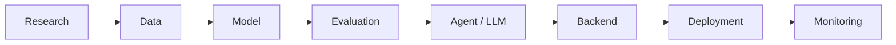
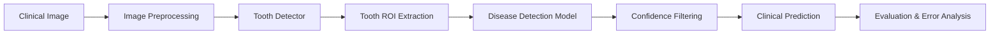
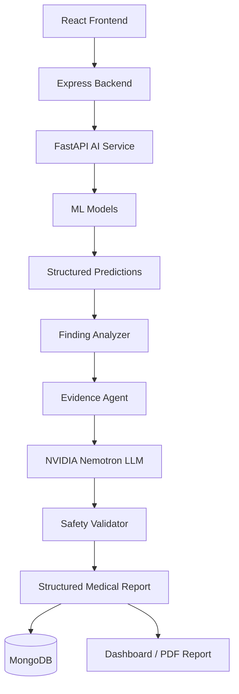
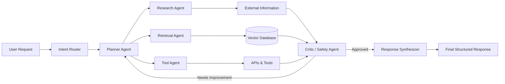
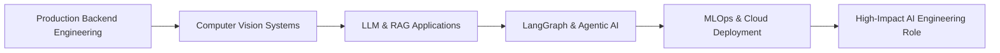

<div align="center">


<br/>

**AI Research Intern @ OralVis Healthcare, IIT Hyderabad** · Lucknow, India

<br/>

<a href="https://www.linkedin.com/in/saumsriv/">
  
</a>
<a href="mailto:saumyasriv21@gmail.com">
  
</a>
<a href="https://github.com/saumyasrivastava21">
  
</a>
<a href="https://leetcode.com/u/saumsrivastava21/">
  
</a>

<br/><br/>


</div>

---

## 👨‍💻 About Me


```yaml
name: Saumya Srivastava
location: Lucknow, India

education:
  degree: B.Tech in Information Technology
  university: Madan Mohan Malaviya University of Technology
  graduation: 2027
  cgpa: 8.60/10

current_role:
  title: AI Research Intern
  organization: OralVis Healthcare, IIT Hyderabad
  domain: Medical Imaging & Computer Vision

engineering_focus:
  - Production-ready AI systems
  - Medical computer vision
  - YOLO-based detection pipelines
  - LLM applications & RAG
  - LangGraph & agentic AI
  - FastAPI & Spring Boot backends
  - Cloud deployment & AI system reliability

mission:
  Build scalable AI products that solve meaningful real-world problems.
```

I build AI systems that connect models, retrieval, agents and production infrastructure into usable software — my work spans medical computer vision research, LLM applications, agentic workflows and production-oriented backend systems.

- 🧠 Working on **medical imaging, dental AI and deep-learning research pipelines**
- 🤖 Building **RAG systems, AI agents and LLM-powered applications**
- ⚙️ Developing scalable backends with **FastAPI, Spring Boot and PostgreSQL**
- 🔬 Experienced in **dataset engineering, model evaluation and failure-case analysis**
- 🚀 Exploring **LangGraph, vector databases, hybrid retrieval and evaluation-driven agent workflows**
- 🏆 Winner — **ICMR & IIT Kanpur National Federation Hackathon** (300+ teams)

<br clear="right"/>

---

## 🧭 Enginering Philosophy

<div align="center">


```mermaid
flowchart LR
    A[Research] --> B[Data]
    B --> C[Model]
    C --> D[Evaluation]
    D --> E[Agent / LLM]
    E --> F[Backend]
    F --> G[Deployment]
    G --> H[Monitoring]
```

</div>

I care about taking AI systems beyond notebooks and into usable, reliable software — every project moves through rigorous evaluation before it becomes a real backend service, not just a demo script.

---

## 🚧 Currently Building

<div align="center">

| Focus Area | Description | Core Technologies |
|---|---|---|
| 🩺 **Medical AI Platforms** | End-to-end pipelines from clinical image to structured AI report | YOLO, PyTorch, FastAPI, LLMs |
| 🤖 **Agentic AI Systems** | Tool-using agents, planning workflows and evidence-based reasoning | LangGraph, LangChain, LLM APIs, FastAPI |
| 📚 **Advanced RAG** | Retrieval, evidence retrieval and grounded generation | pgvector, Qdrant, FAISS, Embeddings |
| 🏥 **Medical AI Research** | Dental disease detection, two-stage ROI pipelines | YOLO, PyTorch, OpenCV, Ultralytics |
| ⚙️ **Production Backends** | Authentication, microservices, APIs, async tasks | Spring Boot, FastAPI, Kafka, Redis |
| ☁️ **AI Deployment** | Containerized inference and cloud-ready AI services | Docker, AWS EC2, S3, Nginx, GitHub Actions |

</div>

---

# 💼 Experience

## 🧠 AI Research Intern — OralVis Healthcare, IIT Hyderabad
**January 2026 – Present**

- Developing AI workflows for confidential **dental and medical imaging datasets**.
- Built preprocessing, annotation-validation, ROI-extraction and object-detection pipelines.
- Designed a two-stage computer vision workflow:


```mermaid
flowchart LR
    A[Clinical Image] --> B[Image Preprocessing]
    B --> C[Tooth Detector]
    C --> D[Tooth ROI Extraction]
    D --> E[Disease Detection Model]
    E --> F[Confidence Filtering]
    F --> G[Clinical Prediction]
    G --> H[Evaluation & Error Analysis]
```

- Trained and evaluated YOLO-based models for tooth and disease detection.
- Worked on augmentation, hard-negative mining, class balancing and hyperparameter tuning.
- Performed annotation-agreement analysis using Hungarian matching, Cohen's Kappa, Fleiss' Kappa and IoU-based spatial matching.
- Evaluated models using Precision, Recall, F1, IoU, mAP@50, mAP@50–95, precision–recall curves and confusion matrices.
- Built visualization and inference pipelines for reviewing predictions on unseen clinical images.

## 🏷️ Machine Learning Data Annotator — Mechanica Sistemi
**April 2026 – May 2026**

- Annotated and refined more than **10,000 images** for production computer vision datasets.
- Worked with bounding boxes, segmentation masks and SAM-assisted annotation.
- Conducted label-quality checks and corrected inconsistent annotations.
- Helped prepare clean datasets for object-detection and segmentation training.

---

# 🌟 Featured Projects

## 🏥 Jeevansh AI — Flagship Project

### AI-Powered Medical Imaging Analysis & Intelligent Reporting Platform

A full-stack medical AI platform that takes a clinical image through detection, analysis and agentic report generation into a structured, safety-validated medical report.

**Capabilities**
- Multi-model medical image analysis — skin cancer classification, pneumonia classification, brain tumor detection, bone fracture detection
- YOLO-based object detection and classification models
- FastAPI AI inference service behind an Express backend and React frontend
- AI-generated medical report layer powered by NVIDIA Nemotron
- Agentic report orchestration: finding analyzer → evidence agent → safety validator
- Structured report generation with PDF export
- Dashboard with report history and an AI chatbot
- End-to-end image upload and inference workflow with MongoDB persistence and authentication

**Architecture**


```mermaid
flowchart TB
    A[React Frontend] --> B[Express Backend]
    B --> C[FastAPI AI Service]
    C --> D[ML Models]
    D --> E[Structured Predictions]
    E --> F[Finding Analyzer]
    F --> G[Evidence Agent]
    G --> H[NVIDIA Nemotron LLM]
    H --> I[Safety Validator]
    I --> J[Structured Medical Report]
    J --> K[(MongoDB)]
    J --> L[Dashboard / PDF Report]
```

**Tech Stack**

`React` `Express` `FastAPI` `MongoDB` `YOLO` `PyTorch`
`NVIDIA Nemotron` `Agentic Orchestration` `PDF Generation` `Authentication`

---

<table>
<tr>
<td width="50%" valign="top">

## 🧠 SkillSync AI

### AI-Powered Resume Intelligence Platform

A production-oriented platform that helps candidates analyze resumes and enables recruiters to search, filter and rank applicants.

**Candidate Portal**
- Resume upload & PDF parsing, skill extraction
- Resume vs. job-description analysis with ATS-style scoring
- Matched/missing skills, evidence retrieval, AI recommendations
- Analysis history dashboard

**Recruiter Portal**
- Candidate search, filtering and ranking
- Resume intelligence reports & profile analysis
- Recruiter analytics, search-indexing foundation

**Tech Stack**

`React` `TypeScript` `FastAPI` `PostgreSQL`
`Redis` `SQLAlchemy` `JWT` `Docker`
`LLMs` `Embeddings` `RAG` `Solr`

</td>
<td width="50%" valign="top">

## 🔬 Medical Imaging AI Research

### Dental Disease Detection Research

Research-focused computer vision pipelines for clinical image preprocessing, tooth detection, ROI extraction and disease localization — the research foundation behind the OralVis internship work.

**Key Work**
- YOLO tooth detector + disease-specific ROI models
- Two-stage detection architecture
- Positive/negative ROI mining, hard-negative sampling
- Dataset auditing and annotation-agreement analysis
- Prediction visualization and model-reliability analysis

**Tech Stack**

`YOLOv8` `YOLO11` `PyTorch` `OpenCV`
`Ultralytics` `Pandas` `Matplotlib` `FastAPI`

</td>
</tr>

<tr>
<td width="50%" valign="top">

## 🌐 LinkedIn Microservices Platform

### Distributed Social Networking Backend

A microservices-based LinkedIn-inspired platform with independent services for users, posts, connections, feeds and notifications — evidence of backend and distributed-systems engineering.

**Services**

User · Connection · Post · Feed · Notification · API Gateway · Authentication

**Tech Stack**

`Java` `Spring Boot` `Spring Security`
`PostgreSQL` `Neo4j` `Kafka` `JWT`
`Docker` `Kubernetes` `API Gateway`

</td>
<td width="50%" valign="top">

## 🌱 KrishiMitram

### AI-Powered Agriculture Platform

An agriculture-intelligence platform for crop-disease classification and crop-yield estimation, built for farmer-facing use.

**Features**
- Crop disease classification across 40+ classes
- CNN and transfer-learning models
- Gradient-boosting yield estimation
- Full-stack AI integration with a farmer-oriented interface

**Tech Stack**

`Python` `PyTorch` `CNNs` `Transfer Learning`
`Gradient Boosting` `React` `FastAPI`

</td>
</tr>

<tr>
<td width="50%" valign="top">

## 🛣️ RoadGuard AI

### AI-Powered Pothole Detection System

A full-stack computer vision application that detects potholes and road damage from uploaded images.

**Features**
- Custom-trained YOLO inference with confidence scores
- Bounding-box visualization, annotated output
- FastAPI REST endpoints, responsive React dashboard

**Tech Stack**

`YOLO` `FastAPI` `OpenCV` `Pillow`
`React` `TypeScript` `Vite` `Tailwind CSS`

</td>
<td width="50%" valign="top">

## 🧠 Brain Tumor Detection

### MRI Object Detection with YOLOv9

A deep-learning system designed to detect brain-tumor regions from MRI scans.

**Highlights**
- Custom MRI dataset pipeline
- YOLOv9 object detection with augmentation
- Precision–recall analysis and bounding-box visualization

**Tech Stack**

`YOLOv9` `PyTorch` `OpenCV`
`Medical Imaging` `Deep Learning`

</td>
</tr>

<tr>
<td width="50%" valign="top">

## 🔥 AGNI RAKSHAK

### IoT-Based Forest Fire Detection System

A distributed forest-fire risk-detection system combining IoT sensor networks and machine learning.

**Features**
- Temperature, humidity and CO₂-based risk analysis
- Random Forest risk prediction over an RPL mesh network
- Contiki-NG / Cooja-based simulation and early-warning workflow

**Tech Stack**

`Python` `Random Forest` `IoT`
`Contiki-NG` `Cooja` `RPL`

</td>
<td width="50%" valign="top">

## 🔄 Candidate Data Transformer

### Production-Style Data Engineering CLI

A modular command-line pipeline that transforms heterogeneous candidate data into a validated canonical profile.

**Features**
- CSV / ATS / recruiter-notes parsers
- Source-aware merging with confidence-based field resolution
- Schema validation with unit and integration testing

**Tech Stack**

`Python` `Pydantic` `JSON` `CLI`
`Data Validation` `Testing`

</td>
</tr>
</table>

---

# 🤖 Agentic AI Architecture


```mermaid
flowchart LR
    U[User Request] --> R[Intent Router]
    R --> P[Planner Agent]
    P --> RE[Research Agent]
    P --> RET[Retrieval Agent]
    P --> T[Tool Agent]
    RE --> WEB[External Information]
    RET --> VDB[(Vector Database)]
    T --> API[APIs & Tools]
    WEB --> C[Critic / Safety Agent]
    VDB --> C
    API --> C
    C -->|Needs Improvement| P
    C -->|Approved| S[Response Synthesizer]
    S --> F[Final Structured Response]
```

---

# 🧰 Technology Arsenal

<div align="center">

**Programming Languages**


**AI & Machine Learning**


**Backend Engineering**


**Frontend Engineering**


**Databases & Search**


**Cloud & DevOps**


</div>

---

# 🧠 AI Engineering Stack

<div align="center">

**Large Language Models**


**RAG & Agentic AI**


**Vector Databases & Retrieval**


</div>

---

# 🔬 Computer Vision & Research Skills

<div align="center">

| Area | Skills |
|---|---|
| **Object Detection** | YOLOv5, YOLOv8, YOLOv9, YOLO11, Bounding Boxes, NMS |
| **Medical Imaging** | Clinical Image Analysis, ROI Detection, Disease Localization |
| **Image Processing** | OpenCV, Resizing, Normalization, Augmentation |
| **Dataset Engineering** | Auditing, Splitting, Label Validation, Hard-Negative Mining |
| **Training** | Transfer Learning, Hyperparameter Tuning, Class Balancing |
| **Evaluation** | Precision, Recall, F1, IoU, mAP@50, mAP@50–95 |
| **Agreement Analysis** | Cohen's Kappa, Fleiss' Kappa, Hungarian Matching |
| **Deployment** | FastAPI Inference, Docker, AWS EC2, REST APIs |

</div>

---

# ⚙️ Backend & Software Engineering

<div align="center">

| Category | Technologies |
|---|---|
| **Java Backend** | Java, Spring Boot, Spring Security |
| **Python Backend** | FastAPI, Pydantic, SQLAlchemy |
| **Authentication** | JWT, Role-Based Access Control |
| **Databases** | PostgreSQL, MySQL, MongoDB, Neo4j |
| **Caching & Messaging** | Redis, Kafka |
| **Architecture** | REST APIs, Microservices, API Gateway |
| **Testing** | Unit Testing, Integration Testing |
| **Deployment** | Docker, Nginx, AWS EC2, GitHub Actions |

</div>

---

# 🏆 Achievements

<div align="center">

| Achievement | Highlight |
|---|---|
| 🥇 **ICMR & IIT Kanpur National Federation Hackathon Winner** | Built an AI-driven healthcare solution selected among 300+ teams |
| 🧠 **AI Research Intern — OralVis Healthcare, IIT Hyderabad** | Working on medical-imaging and dental-AI research pipelines |
| 🎓 **CGPA: 8.60/10** | B.Tech Information Technology, MMMUT Gorakhpur (2023–2027) |

</div>

---

# 📊 GitHub Analytics

<div align="center">


<br/>


</div>

---

# 📈 Contribution Activity

<div align="center">


</div>

---

# 🏅 GitHub Trophies

<div align="center">


</div>

---

# 🐍 Contribution Snake

<div align="center">

<picture>
  <source media="(prefers-color-scheme: dark)" srcset="https://raw.githubusercontent.com/saumyasrivastava21/saumyasrivastava21/output/github-contribution-grid-snake-dark.svg">
  <source media="(prefers-color-scheme: light)" srcset="https://raw.githubusercontent.com/saumyasrivastava21/saumyasrivastava21/output/github-contribution-grid-snake.svg">
  
</picture>

</div>

---

# 🎯 2026 Roadmap


```mermaid
flowchart LR
    A[Production Backend Engineering] --> B[Computer Vision Systems]
    B --> C[LLM & RAG Applications]
    C --> D[LangGraph & Agentic AI]
    D --> E[MLOps & Cloud Deployment]
    E --> F[High-Impact AI Engineering Role]
```

**Current Objectives**
- Build production-ready **agentic AI and RAG systems**
- Strengthen **Spring Boot and distributed backend architecture**
- Deploy AI applications using **Docker and AWS**
- Improve model reliability through structured **evaluation and monitoring**
- Continue research in **medical imaging and applied computer vision**

---

# 🤝 Let's Connect

<div align="center">

### Building at the intersection of AI research, intelligent systems and production engineering.

I'm open to opportunities and collaborations involving:

**Artificial Intelligence • Machine Learning • Computer Vision • Medical AI**
**LLM Applications • RAG • Agentic AI • Backend Engineering**

<br/>

<a href="https://github.com/saumyasrivastava21">
  
</a>
<a href="https://www.linkedin.com/in/saumsriv/">
  
</a>
<a href="mailto:saumyasriv21@gmail.com">
  
</a>
<a href="https://leetcode.com/u/saumsrivastava21/">
  
</a>


</div>
