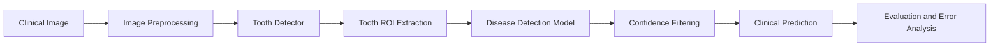
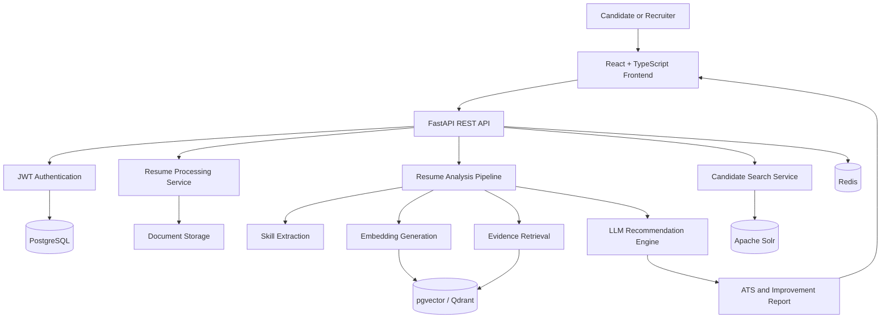
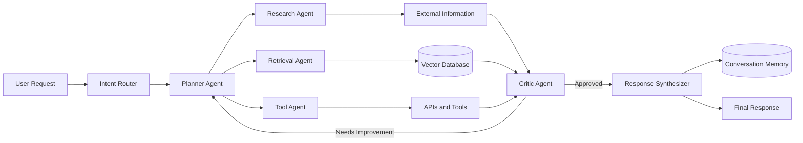
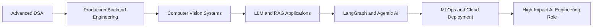

<div align="center">


<br/>

<a href="https://www.linkedin.com/in/saumsriv/">
  
</a>
<a href="mailto:saumyasriv21@gmail.com">
  
</a>
<a href="https://github.com/saumyasrivastava21">
  
</a>
<a href="https://leetcode.com/u/saumsrivastava21/">
  
</a>

<br/><br/>


</div>

---

## 👨‍💻 About Me


```yaml
name: Saumya Srivastava
location: Lucknow, India

education:
  degree: B.Tech in Information Technology
  university: Madan Mohan Malaviya University of Technology
  graduation: 2027
  cgpa: 8.60/10

current_role:
  title: AI Research Intern
  organization: OralVis Healthcare, IIT Hyderabad
  domain: Medical Imaging and Computer Vision

engineering_focus:
  - Production-ready AI systems
  - Medical Computer Vision
  - YOLO-based detection pipelines
  - LLM applications and RAG
  - LangGraph and Agentic AI
  - FastAPI and Spring Boot backends
  - Docker and cloud deployment

problem_solving:
  primary_language: Java
  leetcode: 500+ problems solved

mission:
  Build scalable AI products that solve meaningful real-world problems.
```

- 🧠 Working on **medical imaging, dental AI and deep-learning research pipelines**
- 🤖 Building **RAG systems, AI agents and LLM-powered applications**
- ⚙️ Developing scalable backends using **FastAPI, Spring Boot and PostgreSQL**
- 🔬 Experienced in **dataset engineering, model evaluation and failure analysis**
- 🚀 Exploring **LangGraph, vector databases, hybrid retrieval and agent workflows**
- 🎯 Targeting **AI Engineer, ML Engineer, Computer Vision Engineer and SDE roles**
- 🏆 Winner of the **ICMR and IIT Kanpur National Federation Hackathon**

<br clear="right"/>

---

## 🚧 Currently Building

<div align="center">

| Project | Current Focus | Core Technologies |
|---|---|---|
| 🧠 **SkillSync AI** | AI-powered resume intelligence and candidate-ranking platform | FastAPI, React, PostgreSQL, Redis, LLMs |
| 🤖 **Agentic AI Systems** | Tool-using agents, planning workflows and multi-agent systems | LangGraph, LangChain, LLM APIs, FastAPI |
| 📚 **Advanced RAG** | Hybrid retrieval, reranking, evidence retrieval and evaluation | pgvector, Qdrant, FAISS, ChromaDB |
| 🏥 **Medical AI Research** | Dental disease detection and two-stage ROI pipelines | YOLO, PyTorch, OpenCV, Ultralytics |
| ⚙️ **Production Backends** | Authentication, microservices, APIs and asynchronous tasks | Spring Boot, FastAPI, Kafka, Redis, Celery |
| ☁️ **AI Deployment** | Containerized inference and cloud-ready AI services | Docker, AWS EC2, S3, Nginx, GitHub Actions |

</div>

---

# 💼 Experience

## 🧠 AI Research Intern — OralVis Healthcare, IIT Hyderabad

**January 2026 – Present**

- Developing AI workflows for confidential **dental and medical imaging datasets**.
- Built preprocessing, annotation-validation, ROI-extraction and object-detection pipelines.
- Designed a two-stage computer vision workflow:


```mermaid
flowchart LR
    A[Clinical Image] --> B[Image Preprocessing]
    B --> C[Tooth Detector]
    C --> D[Tooth ROI Extraction]
    D --> E[Disease Detection Model]
    E --> F[Confidence Filtering]
    F --> G[Clinical Prediction]
    G --> H[Evaluation and Error Analysis]
```

- Trained and evaluated YOLO-based models for tooth and disease detection.
- Worked on augmentation, hard-negative mining, class balancing and hyperparameter tuning.
- Performed annotation-agreement analysis using:
  - Hungarian matching
  - Cohen’s Kappa
  - Fleiss’ Kappa
  - IoU-based spatial matching
- Evaluated models using:
  - Precision and Recall
  - F1-score
  - IoU
  - mAP@50
  - mAP@50–95
  - Precision–Recall curves
  - Confusion matrices
  - Failure-case inspection
- Built visualization and inference pipelines for reviewing predictions on unseen clinical images.

---

## 🏷️ Machine Learning Data Annotator — Mechanica Sistemi

**April 2026 – May 2026**

- Annotated and refined more than **10,000 images** for production computer vision datasets.
- Worked with bounding boxes, segmentation masks and SAM-assisted annotation.
- Conducted label-quality checks and corrected inconsistent annotations.
- Helped prepare clean datasets for object-detection and segmentation training.

---

# 🌟 Featured Projects

<table>
<tr>
<td width="50%" valign="top">

## 🧠 SkillSync AI

### AI-Powered Resume Intelligence Platform

A production-oriented platform that helps candidates analyze resumes and enables recruiters to search, filter and rank applicants.

### Candidate Portal

- Resume upload and PDF parsing
- Automatic skill extraction
- Resume versus job-description analysis
- ATS-style score generation
- Matched and missing skills
- Resume evidence retrieval
- AI-powered recommendations
- Previous-analysis dashboard

### Recruiter Portal

- Candidate search and filtering
- Candidate ranking
- Resume intelligence reports
- Candidate profile analysis
- Recruiter analytics dashboard
- Search-indexing foundation

### Tech Stack

`React` `TypeScript` `FastAPI` `PostgreSQL`  
`Redis` `SQLAlchemy` `JWT` `Docker`  
`LLMs` `Embeddings` `RAG` `Solr`

</td>

<td width="50%" valign="top">

## 🔄 Candidate Data Transformer

### Production-Style Data Engineering Assignment

A modular command-line pipeline that transforms heterogeneous candidate data into a validated canonical profile.

### Key Features

- CSV profile parser
- ATS export parser
- Recruiter-notes parser
- Source-aware data merging
- Confidence-based field resolution
- Canonical-profile generation
- Output-schema validation
- Unit and integration testing
- CLI-based execution
- Clean modular architecture

### Engineering Focus

- Separation of concerns
- Data validation
- Error handling
- Explainable source merging
- Extensible parser architecture
- Production-quality documentation

### Tech Stack

`Python` `Pydantic` `JSON` `CLI`  
`Data Validation` `Testing` `Modular Design`

</td>
</tr>

<tr>
<td width="50%" valign="top">

## 🏥 Medical Imaging AI Pipelines

### Dental Disease Detection Research

Research-focused computer vision pipelines for clinical image preprocessing, tooth detection, ROI extraction and disease localization.

### Key Work

- YOLO tooth detector
- Disease-specific ROI models
- Two-stage detection architecture
- Positive and negative ROI mining
- Hard-negative sampling
- Dataset auditing
- Annotation-agreement analysis
- Prediction visualization
- Model reliability analysis
- Full-image inference

### Tech Stack

`YOLOv8` `YOLO11` `PyTorch` `OpenCV`  
`Ultralytics` `Pandas` `Matplotlib` `FastAPI`

</td>

<td width="50%" valign="top">

## 🛣️ RoadGuard AI

### AI-Powered Pothole Detection System

A full-stack computer vision application that detects potholes and road damage from uploaded images.

### Key Features

- Drag-and-drop image upload
- Custom-trained YOLO inference
- Bounding-box visualization
- Detection confidence scores
- Annotated output generation
- FastAPI REST endpoints
- Responsive React dashboard
- Deployment-ready project structure

### Tech Stack

`YOLO` `FastAPI` `OpenCV` `Pillow`  
`React` `TypeScript` `Vite` `Tailwind CSS`

</td>
</tr>

<tr>
<td width="50%" valign="top">

## 🌐 LinkedIn Microservices Platform

### Distributed Social Networking Backend

A microservices-based LinkedIn-inspired platform with independent services for users, posts, connections, feeds and notifications.

### Services

- User service
- Connection service
- Post service
- Feed service
- Notification service
- API Gateway
- Authentication service

### Tech Stack

`Java` `Spring Boot` `Spring Security`  
`PostgreSQL` `Neo4j` `Kafka` `JWT`  
`Docker` `Kubernetes` `API Gateway`

</td>

<td width="50%" valign="top">

## 🌱 KrishiMitram

### AI-Powered Agriculture Platform

An agriculture-intelligence platform for crop-disease classification and crop-yield estimation.

### Key Features

- Crop disease classification
- More than 40 disease classes
- CNN and transfer-learning models
- Image preprocessing pipeline
- Yield-estimation workflow
- Gradient-boosting prediction
- Farmer-oriented interface
- Full-stack AI integration

### Tech Stack

`Python` `PyTorch` `CNNs` `Transfer Learning`  
`Gradient Boosting` `React` `FastAPI`

</td>
</tr>

<tr>
<td width="50%" valign="top">

## 🔥 AGNI RAKSHAK

### IoT-Based Forest Fire Detection System

A distributed forest-fire risk-detection system combining IoT sensor networks and machine learning.

### Key Features

- Temperature and humidity analysis
- CO₂-based risk detection
- Random Forest risk prediction
- RPL mesh networking
- Contiki-NG simulation
- Cooja-based network testing
- Early-warning workflow

### Tech Stack

`Python` `Random Forest` `IoT`  
`Contiki-NG` `Cooja` `RPL`

</td>

<td width="50%" valign="top">

## 🧠 Brain Tumor Detection

### MRI Object Detection with YOLOv9

A deep-learning system designed to detect brain-tumor regions from MRI scans.

### Model Highlights

- Custom MRI dataset pipeline
- YOLOv9 object detection
- Data preprocessing and augmentation
- Precision–Recall analysis
- Bounding-box visualization
- Validation and test evaluation

### Tech Stack

`YOLOv9` `PyTorch` `OpenCV`  
`Medical Imaging` `Deep Learning`

</td>
</tr>
</table>

---

# 🏗️ SkillSync AI Architecture


```mermaid
flowchart TB
    U[Candidate or Recruiter] --> UI[React + TypeScript Frontend]

    UI --> API[FastAPI REST API]

    API --> AUTH[JWT Authentication]
    API --> RESUME[Resume Processing Service]
    API --> ANALYSIS[Resume Analysis Pipeline]
    API --> SEARCH[Candidate Search Service]

    AUTH --> DB[(PostgreSQL)]
    RESUME --> STORAGE[Document Storage]
    ANALYSIS --> EXTRACT[Skill Extraction]
    ANALYSIS --> EMBED[Embedding Generation]
    ANALYSIS --> RETRIEVE[Evidence Retrieval]
    ANALYSIS --> LLM[LLM Recommendation Engine]

    EMBED --> VECTOR[(pgvector / Qdrant)]
    RETRIEVE --> VECTOR

    SEARCH --> SOLR[(Apache Solr)]
    API --> CACHE[(Redis)]

    LLM --> REPORT[ATS and Improvement Report]
    REPORT --> UI
```

---

# 🤖 Agentic AI Architecture


```mermaid
flowchart LR
    U[User Request] --> R[Intent Router]

    R --> P[Planner Agent]
    P --> RE[Research Agent]
    P --> RET[Retrieval Agent]
    P --> T[Tool Agent]

    RE --> WEB[External Information]
    RET --> VDB[(Vector Database)]
    T --> API[APIs and Tools]

    WEB --> C[Critic Agent]
    VDB --> C
    API --> C

    C -->|Needs Improvement| P
    C -->|Approved| S[Response Synthesizer]

    S --> M[(Conversation Memory)]
    S --> F[Final Response]
```

---

# 🧰 Technology Arsenal

<div align="center">

## Programming Languages


<br/><br/>

## Artificial Intelligence and Machine Learning


<br/><br/>

## Backend Engineering


<br/><br/>

## Frontend Engineering


<br/><br/>

## Databases and Search


<br/><br/>

## Cloud and DevOps


</div>

---

# 🧠 AI Engineering Stack

<div align="center">

### Large Language Models


<br/><br/>

### RAG and Agentic AI


<br/><br/>

### Vector Databases and Retrieval


</div>

---

# 🔬 Computer Vision and Research Skills

<div align="center">

| Area | Skills |
|---|---|
| **Object Detection** | YOLOv5, YOLOv8, YOLOv9, YOLO11, Bounding Boxes, NMS |
| **Medical Imaging** | Clinical Image Analysis, ROI Detection, Disease Localization |
| **Image Processing** | OpenCV, CLAHE, Resizing, Normalization, Augmentation |
| **Dataset Engineering** | Dataset Auditing, Splitting, Label Validation, Hard-Negative Mining |
| **Training** | Transfer Learning, Hyperparameter Tuning, Class Balancing |
| **Evaluation** | Precision, Recall, F1, IoU, mAP@50, mAP@50–95 |
| **Agreement Analysis** | Cohen’s Kappa, Fleiss’ Kappa, Hungarian Matching |
| **Explainability** | Grad-CAM, Prediction Visualization, Failure Analysis |
| **Deployment** | FastAPI Inference, Docker, AWS EC2, REST APIs |

</div>

---

# ⚙️ Backend and Software Engineering

<div align="center">

| Category | Technologies |
|---|---|
| **Java Backend** | Java, Spring Boot, Spring Security, JPA, Hibernate, MapStruct |
| **Python Backend** | FastAPI, Pydantic, SQLAlchemy, Alembic, Uvicorn |
| **Authentication** | JWT, Password Hashing, Role-Based Access Control |
| **Databases** | PostgreSQL, MySQL, MongoDB, Neo4j |
| **Caching and Queues** | Redis, Celery, Kafka |
| **Architecture** | REST APIs, Microservices, API Gateway, Layered Architecture |
| **Testing** | Unit Testing, Integration Testing, API Validation |
| **Deployment** | Docker, Docker Compose, Nginx, AWS EC2, GitHub Actions |

</div>

---

# 🏆 Achievements and Leadership

<div align="center">

| Achievement | Highlight |
|---|---|
| 🥇 **ICMR and IIT Kanpur National Federation Hackathon Winner** | Built an AI-driven healthcare solution selected among more than 300 teams |
| 🧠 **AI Research Intern — IIT Hyderabad** | Working on medical-imaging and dental-AI research pipelines |
| 💻 **500+ DSA Problems Solved** | Java-first problem solving across major algorithmic patterns |
| 🎓 **CGPA: 8.60/10** | B.Tech Information Technology at MMMUT Gorakhpur |
| 👥 **Student Secretary — CSSE MMMUT** | Led technical events, coding contests and workshops for 1,000+ participants |
| 🚀 **Production AI Projects** | Built AI, computer-vision, backend and full-stack engineering projects |

</div>

---

# 💻 Data Structures and Algorithms

<div align="center">


</div>

### Problem-Solving Areas

```text
Arrays and Strings      ███████████████████░
Binary Search           ██████████████████░░
Linked Lists            █████████████████░░░
Trees and BST           ██████████████████░░
Graphs                   ██████████████████░░
Dynamic Programming     ████████████████░░░░
Heaps and Greedy        █████████████████░░░
Backtracking            ████████████████░░░░
```

- Primary problem-solving language: **Java**
- More than **500 LeetCode problems solved**
- Regularly practising contests and pattern-based problem solving
- Focused on writing optimized, readable and interview-ready solutions

---

# 📚 Research Interests

<div align="center">


</div>

---

# 📊 GitHub Analytics

<div align="center">


<br/>


<br/><br/>


</div>

---

# 📈 Contribution Activity

<div align="center">


</div>

---

# 🏅 GitHub Trophies

<div align="center">


</div>

---

# 🐍 Contribution Snake

<div align="center">

<picture>
  <source media="(prefers-color-scheme: dark)" srcset="https://raw.githubusercontent.com/saumyasrivastava21/saumyasrivastava21/output/github-contribution-grid-snake-dark.svg">
  <source media="(prefers-color-scheme: light)" srcset="https://raw.githubusercontent.com/saumyasrivastava21/saumyasrivastava21/output/github-contribution-grid-snake.svg">
  
</picture>

</div>

---

# 🎯 2026 Engineering Roadmap


```mermaid
flowchart LR
    A[Advanced DSA] --> B[Production Backend Engineering]
    B --> C[Computer Vision Systems]
    C --> D[LLM and RAG Applications]
    D --> E[LangGraph and Agentic AI]
    E --> F[MLOps and Cloud Deployment]
    F --> G[High-Impact AI Engineering Role]
```

### Current Objectives

- Build production-ready **RAG and Agentic AI systems**
- Strengthen **Spring Boot and distributed backend architecture**
- Deploy AI applications using **Docker and AWS**
- Improve model reliability through structured **evaluation and monitoring**
- Continue research in **medical imaging and applied computer vision**
- Build strong foundations in **system design and scalable AI architecture**

---

# 🤝 Let’s Connect

<div align="center">

### Building at the intersection of AI, research and software engineering.

I am open to opportunities and collaborations involving:

**Artificial Intelligence • Machine Learning • Computer Vision • Medical AI**  
**LLM Applications • RAG • Agentic AI • Backend Engineering • MLOps**

<br/>

<a href="https://www.linkedin.com/in/saumsriv/">
  
</a>
<a href="mailto:saumyasriv21@gmail.com">
  
</a>
<a href="https://github.com/saumyasrivastava21">
  
</a>
<a href="https://leetcode.com/u/saumsrivastava21/">
  
</a>

<br/><br/>

### 💡 “Build systems that do not just demonstrate AI — build systems that deliver value.”


</div>
